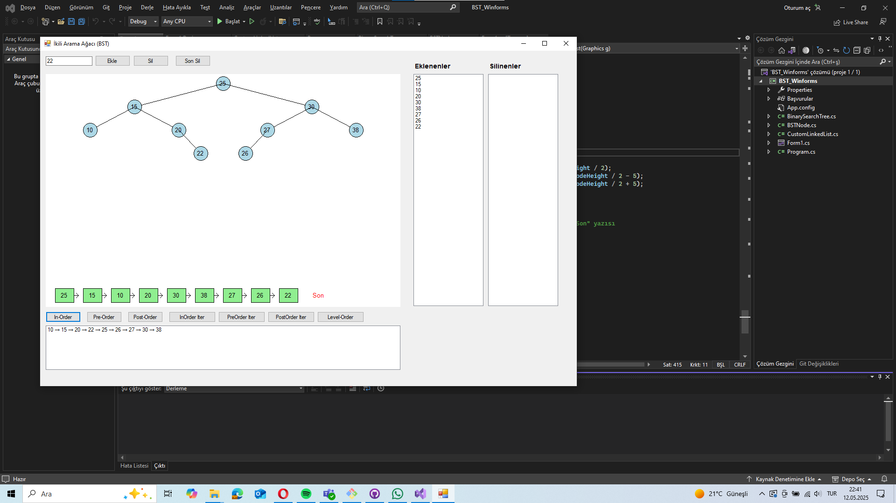

# 👑 GİTHUB LİNK : https://github.com/Alicanayhn/Veri-Yapilari

# 🧠 Binary Search Tree Görselleştirme (C# WinForms)

Bu proje, C# WinForms kullanılarak geliştirilmiş bir **ikili arama ağacı (BST)** görselleştirme uygulamasıdır. Kullanıcılar sayı ekleyebilir, silebilir ve BST üzerinde gezinme algoritmalarını **renkli animasyonlarla** izleyebilir.
## 👥 Grup Üyeleri

| Adı Soyadı        | Numara     | 
|--------------------|------------|
| Ali Can Ayhan      | 032190050  |
| Tolga Babacan      | 032190029  | 
| Osman İlhan        | 032190046  | 
| Koray Kayan        | 032190048  | 
| Zeynep Alperen     | 032190064  |
## 🚀 Özellikler

- 🟦 Sayı ekleme ve BST üzerinde otomatik çizim
- 🔄 In-order, Pre-order, Post-order ve Level-order traversal
- 🟡 Traversal sırasında **düğümleri sarı renkle vurgulama**
- 🔥 **Silme animasyonu**: Silinecek düğüm turuncu, successor yeşil
- 📦 Silinenleri gösteren **Stack** ve sağda liste görünümü
- ✅ Son eklenen sayıyı otomatik silme
- 🔁 Masaüstü uygulama arayüzü

## 📚 Kullanılan Veri Yapıları

- ✅ **Binary Search Tree**  
- ✅ **Stack** → silinenleri tutar  
- ✅ **LinkedList** → eklenen sıralamayı saklar  
- ✅ **List** → traversal sonuçları  
- ✅ **Queue** → Level-order traversal için

## 🖼️ Arayüz (Ekran Görüntüsü)

## 📊 Algoritma ve Veri Yapısı Değerlendirmesi

Bu projede, klasik sabit diziler yerine dinamik veri yapıları tercih edilmiştir. Bu sayede algoritmalar daha esnek, yeniden kullanılabilir ve gerçek dünya senaryolarına uygun hale getirilmiştir.

### 🔁 Bağlı Liste (`CustomLinkedList`)
- **Kullanım:** Kullanıcının eklediği sayıları sırasıyla saklamak için kullanılmıştır.
- **Avantajı:** Sabit uzunlukta olmayan, dinamik olarak büyüyebilen bir yapıdır.
- **Projeye Katkısı:** "Son ekleneni sil" gibi işlemler `RemoveLast()` sayesinde doğrudan ve verimli şekilde yapılmıştır.

### 📦 Yığın (`Stack`)
- **Kullanım:** Silinen düğümler, `Stack` veri yapısında saklanmıştır.
- **Avantajı:** LIFO (Last-In First-Out) prensibi sayesinde son silinen düğüm en üstte tutulur.
- **Projeye Katkısı:** Silinen düğümleri listeleyerek kullanıcıya geçmişi görme ve potansiyel olarak geri alma (undo) yeteneği sunar.

### 🌲 Binary Search Tree (BST)
- **Kullanım:** Sayıların saklandığı ve üzerinde gezinme, ekleme, silme gibi işlemlerin yapıldığı temel ağaç yapısıdır.
- **Avantajı:** Ortalama `O(log n)` karmaşıklıkla arama, ekleme ve silme işlemlerini destekler.
- **Projeye Katkısı:** Görsel olarak ağaç yapısı üzerinde algoritmaların işleyişini gösterir.

### 📥 Kuyruk (`Queue`)
- **Kullanım:** Level-order traversal sırasında BFS algoritmasının uygulanmasında kullanılmıştır.
- **Avantajı:** FIFO mantığı ile ağaç seviyelerini sırayla işler.
- **Projeye Katkısı:** Düğümler soldan sağa, seviyeler halinde vurgulanarak kullanıcıya öğretici bir yapı sunar.

---

### 🔬 Özet Karşılaştırma Tablosu

| Veri Yapısı     | Kullanım Amacı                     | Diziye Göre Avantajı                             |
|------------------|------------------------------------|--------------------------------------------------|
| `LinkedList`     | Eklenenleri sıralı tutmak          | Yeniden boyutlandırmaya gerek kalmaz, esneklik   |
| `Stack`          | Silinenleri saklamak               | Geri alma gibi işlemleri kolaylaştırır           |
| `Queue`          | Level-order gezinme (BFS)          | Düzgün sıra işleme, seviyeli gezinme sağlar      |
| `BST`            | Sayıları verimli şekilde saklamak  | Arama, ekleme ve silme işlemleri çok daha hızlı  |

## 🛠️ Kurulum

1. Visual Studio ile aç  
2. `Form1.cs` içinden uygulamayı başlat  
3. Sayı gir, düğüm ekle veya sil  
4. Traversal butonlarına bas, animasyonları izle

## 🧪 Kullanım

- `Ekle`: Yeni sayı ekler  
- `Sil`: Girilen sayıyı siler (animasyonlu)  
- `Son Sil`: En son ekleneni siler  
- `Traversal`: InOrder, PreOrder, PostOrder, LevelOrder  
- `Silinenler`: Sağdaki listede Stack olarak görünür

